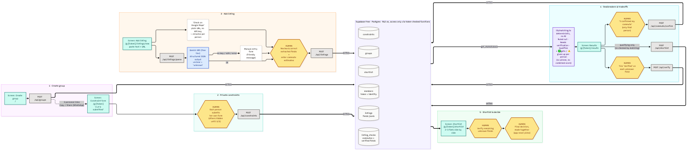

# FlatMatch

Three friends each fill in a private form describing what they need from a shared flat. Then they paste in listings they've found themselves. FlatMatch removes every flat that breaks someone's dealbreaker, flags anything it can't confirm, and shows **what each person gets and what each person gives up** on the flats that are left. **It never picks the flat.** The three of them decide together.

Built for Riya, Meera and Kavita, who spent 4 months in Pune watching listings die one WhatsApp objection at a time:

| Listing | Killed by |
|---|---|
| Baner 3BHK | Kavita's Hinjewadi commute (+45 min each way) |
| Kothrud flat | More than 20 min from Riya's gym and family |
| 5th floor, no lift | Meera's knee condition |

With FlatMatch, all three of those are **ruled out on the first pass**, and each one shows whose dealbreaker it broke and why.

**Try the demo** (seeded data, works without a Gemini key): open `/g/demo-riya`, `/g/demo-meera` or `/g/demo-kavita` on the live URL, or use the buttons on the home page.



## How it works

1. **Create a group.** You get 3 personal links, each with a unique token. There's no login: the link is the identity. Each link has **Copy link** and **Share** buttons (Web Share API → WhatsApp).
2. **Private constraint form.** Each person fills in her own:
   - max rent share
   - no-go areas
   - key locations with a max commute
   - hard requirements: lift, parking, pet-friendly, minimum bathrooms, max floor without a lift
   - nice-to-haves

   Nobody sees anyone else's answers until all three have submitted. This is enforced in the database, not just hidden in the UI. Everyone sees the "2 of 3 submitted" status.
3. **Add a listing.** Paste the listing text and/or URL. **Gemini** turns the text into structured fields, and anything not clearly stated is stored as `"unknown"`, never guessed. The person adding the listing checks and corrects every field. If Gemini isn't configured, hits the free-tier rate limit or fails, the app shows a friendly message and a blank manual form. The app never opens or scrapes the URL.
4. **Commutes, no maps API.** For each person's key location there's a plain **"Check on Google Maps"** link. The person adding the listing types in the minutes. Each estimate stays **unverified** until that person ticks **"I confirmed my commute"**.
5. **Dealbreaker check** (`lib/matching.ts`, plain deterministic TypeScript, no AI):
   - **Ruled out:** a hard constraint is broken. Shown as, e.g., *"Breaks Meera's dealbreaker: 5th floor, no lift"*.
   - **Needs verification:** a hard constraint depends on something unknown, or a commute isn't confirmed yet. The exact fields to ask the broker about are listed. **Unknown is never treated as a pass.**
   - **Qualifies:** every hard constraint for all three is known and met.
6. **Tradeoffs.** For each qualifying flat, one column per person:
   - ✅ what she gets: rent headroom, commute times, nice-to-haves met
   - ⚠️ what she's giving up: nice-to-haves missed
   - ❓ what's still unknown

   There is no combined score. The only sort is labelled plainly: *total nice-to-haves met across all three*.
7. **Shortlist.** Anyone can shortlist a qualifying flat. Shortlisted flats appear side by side, with a **Verified** checkbox on every remaining unknown field, so a person confirms each one before the final discussion.

### Guardrails
- Unknown ≠ pass. Anything unverified is flagged visibly.
- The app never picks the flat and never weighs one friend's needs against another's.
- Each person's constraints stay hidden until all three have submitted. Postgres functions return only the caller's own answers until then.
- Gemini is used **only** to turn pasted listing text into JSON, and only from a server route. The API key never reaches the browser.

## What was deliberately cut, and why

| Cut | Why |
|---|---|
| Automated listing search, scraping, portal integrations (NoBroker, MagicBricks, 99acres…) | There's no reliable, legal listing feed, and listing supply was never the problem. The friends paste in what they find. |
| Any "winner" pick, ranking or weighting of people's needs | The decision belongs to the three friends. The app shows facts and tradeoffs only. |
| Booking, payments, landlord contact | Out of scope, and each adds legal and payment complexity. |
| Paid maps / distance APIs (Google Distance Matrix etc.) | They need a billing account. Plain Maps links plus a human confirmation are free and more honest about traffic. |

## 100% free stack (no credit card needed anywhere)

| Piece | Service | Free tier |
|---|---|---|
| App hosting | Vercel **Hobby** | Free for personal projects |
| Database | Supabase **Free** plan (Postgres) | Free. Pauses after inactivity (see below) |
| Listing parser | Gemini API via **Google AI Studio** free tier (`@google/genai`) | Free, with rate limits |
| Diagram export | `@mermaid-js/mermaid-cli` | Open source, runs locally |

> **Free Supabase projects pause after about 1 week of inactivity.** The live app will then show *"Couldn't reach the database…"*. To resume: [supabase.com/dashboard](https://supabase.com/dashboard) → open the project → **Restore project**, wait a minute or two, then reload the app. Paused free projects can be restored from the dashboard for 90 days. After that, you can download the backup and restore it into a new project. Opening the app every few days keeps it awake.

> **Gemini free-tier note:** on the free tier, Google may use prompts to improve its products. The app only sends the pasted listing text (no names, budgets or other constraints).

## Run locally

```bash
npm install
cp .env.example .env.local   # then fill in the four values
npm run dev                  # http://localhost:3000
npm test                     # unit tests for lib/matching.ts
```

Other scripts:
- `npm run seed:gen`: regenerate `supabase/seed.sql` from `lib/demo-data.ts`, the same data the tests use
- `npm run docs:map`: re-export `docs/components-map.png` from the `.mmd` file

## Setup, step by step

### 1. Free Gemini API key (Google AI Studio)
1. Go to **[aistudio.google.com](https://aistudio.google.com)** and sign in with a Google account.
2. Click **Get API key** → **Create API key**. If it asks, let it create a new project. **Do not** set up billing; the free tier doesn't need it.
3. Copy the key. This is `GEMINI_API_KEY`.
4. `GEMINI_MODEL` defaults to `gemini-3.5-flash-lite`, the newest Flash-Lite, with free-tier access and generous rate limits. To use a different free-tier model, change only this variable (e.g. `gemini-3.8-flash`). Check the current list at [ai.google.dev/gemini-api/docs/models](https://ai.google.dev/gemini-api/docs/models).

### 2. Free Supabase project + schema
1. Go to **[supabase.com](https://supabase.com)** → **Start your project** → sign in (GitHub or email). Choose the **Free** plan. No card is needed.
2. **New project**: pick any name, generate a database password (save it somewhere), and choose the region **Mumbai (ap-south-1)**, the closest to Pune.
3. When it's ready: **SQL Editor** → **New query** → paste all of [`supabase/schema.sql`](supabase/schema.sql) → **Run**.
4. New query again → paste [`supabase/seed.sql`](supabase/seed.sql) → **Run**. This creates the Riya / Meera / Kavita demo. Re-run it any time to reset the demo.
5. **Project Settings → API** (called "Data API" / "API Keys" in some versions): copy the **Project URL** (this is `SUPABASE_URL`) and the **anon public** key (this is `SUPABASE_ANON_KEY`).

   The anon key is only ever used server-side here. Row-level security is on and every table is locked, so the key alone can't read anything. All access goes through token-checked functions.

### 3. Deploy on Vercel (Hobby, free)
1. Sign up at **[vercel.com](https://vercel.com)** with the **Hobby** plan. No card is needed.
2. Put this folder in a GitHub repo and use **Add New → Project → Import**. Or, from this folder, run `npx vercel` and follow the prompts.
3. **Project → Settings → Environment Variables**: add all four for Production (and Preview if you like):
   - `GEMINI_API_KEY`
   - `GEMINI_MODEL` = `gemini-3.5-flash-lite`
   - `SUPABASE_URL`
   - `SUPABASE_ANON_KEY`
4. Redeploy so the variables take effect (**Deployments → ⋯ → Redeploy**, or `npx vercel --prod`).
5. Open the live URL, then try `/g/demo-riya/results`.

`vercel.json` pins the server functions to Mumbai (`bom1`), next to the Supabase database. That's free on Hobby. If your Supabase project is in a different region, change it to the closest [Vercel region](https://vercel.com/docs/regions).

## Project structure

```
supabase/schema.sql    tables + RLS + token-checked Postgres functions
supabase/seed.sql      demo group (generated)
lib/matching.ts        dealbreaker + tradeoff logic (pure, tested)
lib/matching.test.ts   Baner/commute, Kothrud/distance, 5th floor/no lift, unknown ≠ pass, …
lib/demo-data.ts       the scenario, shared by tests and seed
lib/gemini.ts          the only AI call: listing text → JSON, with fallback
lib/db.ts              server-only Supabase RPC client
app/api/*              route handlers (all writes)
app/g/[token]/*        member home/form, add listing, results, shortlist
components/*           UI pieces
docs/components-map.*  architecture diagram (human checkpoints in amber)
```
